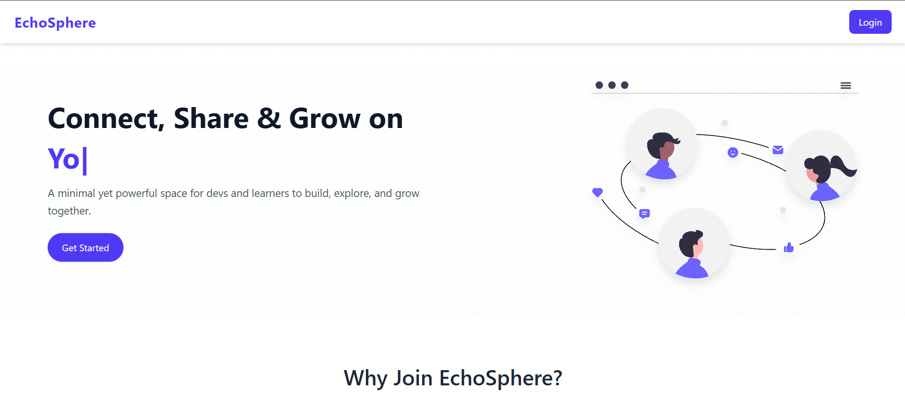
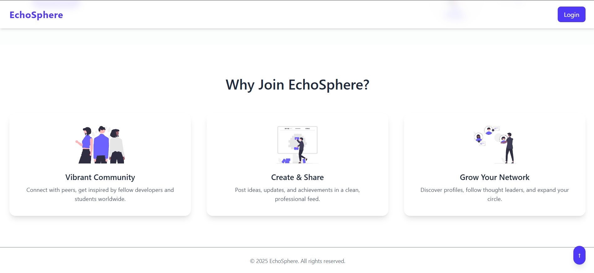
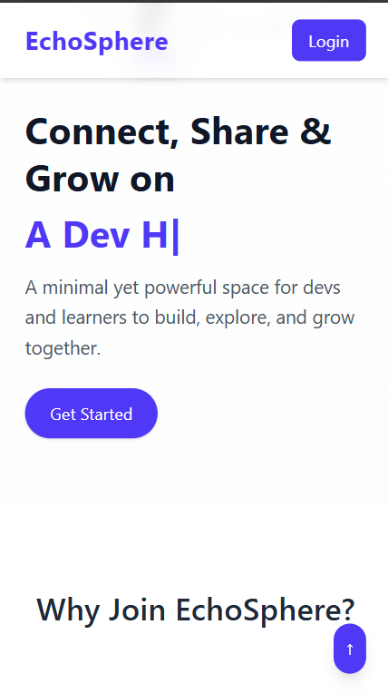
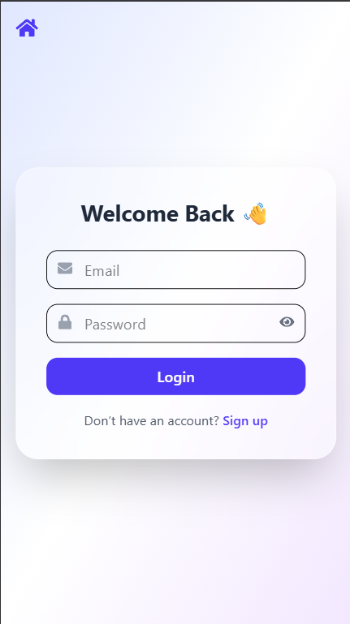
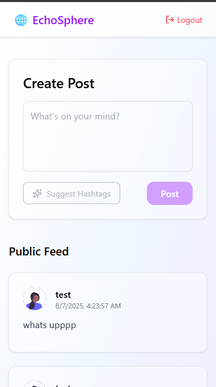

# EchoSphere 🌐

A minimal yet powerful social space for developers, students, and tech enthusiasts to connect, share, and grow together.

🔗 [Live Demo](https://eco-sphere-2btb.vercel.app/)

---

## 🛠️ Stack Used

### Frontend
- **React + Vite**
- **Tailwind CSS**
- **Framer Motion**
- **Lucide Icons**
- **Firebase Auth + Firestore**

### Backend
- **Node.js + Express**
- **@google/generative-ai SDK** for hashtag suggestions (Gemini API)

---

## 🚀 Features

- 🔐 Authentication (Login & Signup with Firebase)
- 📝 Post creation with real-time Firestore sync
- 🔖 Smart hashtag suggestions using Gemini API
- 💬 Public Feed with animated UI
- 🌙 Mobile-first, glassmorphism inspired design

---

## 📸 Previews











---

## ⚙️ Setup Instructions

### Prerequisites
- Node.js v18+
- Firebase Project with Firestore & Auth enabled
- Gemini API Key (from [Google AI Studio](https://makersuite.google.com/))

### Clone the Repo

```bash
git clone https://github.com/your-username/echosphere.git
cd echosphere
```

### 🔧 Setup Client

```bash
cd client
npm install
# Create a .env file
touch .env
```

`.env` (inside `/client`):
```
VITE_FIREBASE_API_KEY=your_key
VITE_FIREBASE_AUTH_DOMAIN=...
VITE_FIREBASE_PROJECT_ID=...
VITE_FIREBASE_STORAGE_BUCKET=...
VITE_FIREBASE_MESSAGING_SENDER_ID=...
VITE_FIREBASE_APP_ID=...
VITE_BACKEND_URL=https://your-server-url
```

### ⚙️ Setup Server

```bash
cd ../server
npm install
# Create a .env file
touch .env
```

`.env` (inside `/server`):
```
GEMINI_API_KEY=your_google_gemini_api_key
PORT=5000
```

Start the server:
```bash
node server.js
```

---

## 👤 Admin/Demo Credentials

> No special admin panel. Signup with email to start using.

---

## 📦 Build & Deploy

- Frontend: Vercel / Netlify
- Backend: Render / Railway / Cyclic (Node.js server)
- Set environment variables accordingly in each platform

---

## 📄 License

MIT License
